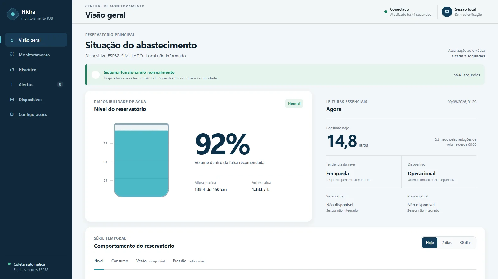

# Monitoramento hídrico com IoT

MVP acadêmico para receber leituras de nível de água enviadas por um ESP32, armazená-las no MongoDB e apresentá-las em um dashboard web servido por uma API Flask.



> Captura real da aplicação em execução. Os dados exibidos são simulados e não representam um reservatório em produção.

## Demonstração

A demonstração pública está temporariamente indisponível porque o backend precisa de uma hospedagem Python e de uma instância MongoDB configurada. O projeto pode ser executado localmente com MongoDB ou no modo de demonstração em memória descrito abaixo.

## Contexto

Projeto acadêmico desenvolvido para praticar integração entre hardware, API, banco de dados e visualização web. Não é um sistema comercial nem uma solução validada para operação crítica.

## Minha contribuição

No código público, trabalhei na integração do firmware do ESP32 com a API, na persistência das leituras, na migração de dados legados e na apresentação do histórico no dashboard. Esta versão também organiza a configuração, valida as entradas da API e adiciona testes automatizados.

## Problema resolvido

Centralizar leituras de um sensor ultrassônico instalado em um reservatório, permitindo consultar o nível atual, o volume estimado, o histórico e alertas básicos em uma interface web.

## Funcionalidades implementadas

- recebimento de leituras de nível por HTTP;
- validação de campos, tipos e faixas aceitas pela API;
- armazenamento de leituras no MongoDB;
- consulta da leitura mais recente e do histórico por período;
- alertas para níveis abaixo de 50% e 20%;
- dashboard responsivo com atualização periódica;
- gráfico de nível e consumo estimado;
- estados de carregamento, ausência de dados e falha da API;
- script para enviar dados simulados sem um ESP32;
- migração opcional de uma base SQLite local antiga para MongoDB.

Pressão e vazão aparecem como **indisponíveis** na interface porque esses sensores ainda não estão integrados ao backend.

## Tecnologias

- ESP32 e sensor HC-SR04;
- Python 3.10 ou superior;
- Flask e Flask-Cors;
- MongoDB e PyMongo;
- HTML, CSS e JavaScript;
- Chart.js;
- pytest e mongomock para testes isolados.

## Arquitetura e fluxo dos dados

```text
ESP32 → API Flask → MongoDB → Dashboard
```

1. O ESP32 mede a distância da superfície da água.
2. O firmware calcula nível, percentual e volume estimado.
3. O dispositivo envia um `POST /api/data` para a API Flask.
4. A API valida e grava a leitura no MongoDB.
5. O dashboard consulta os endpoints de leitura, histórico e alertas a cada intervalo configurado.

## Decisão técnica

As leituras usam timestamps ISO 8601 em UTC. Isso mantém a ordenação cronológica compatível com documentos antigos e evita depender do fuso horário do servidor. A coleção também recebe um índice decrescente em `timestamp` durante a inicialização local da aplicação.

## Instalação

```bash
git clone https://github.com/icarofdev/recursos-hidricos-r3b.git
cd recursos-hidricos-r3b
python -m venv .venv
```

Ative o ambiente virtual:

```bash
# Windows PowerShell
.venv\Scripts\Activate.ps1

# Linux ou macOS
source .venv/bin/activate
```

Instale as dependências:

```bash
pip install -r requirements.txt
```

## Variáveis de ambiente

Copie `.env.example` para `.env` e ajuste apenas os valores necessários:

```env
MONGO_URI=mongodb://localhost:27017/
MONGO_DB_NAME=recursos_hidricos
MONGO_COLLECTION_NAME=sensor_data
PORT=5000
FLASK_DEBUG=false
```

Também é aceito `MONGODB_URI` no lugar de `MONGO_URI` e `MONGO_COLLECTION` no lugar de `MONGO_COLLECTION_NAME`.

Nunca versione o arquivo `.env` nem uma URI que contenha usuário e senha.

## Execução

Com uma instância MongoDB disponível:

```bash
python app.py
```

Abra [http://localhost:5000](http://localhost:5000).

Em produção, configure as variáveis de ambiente e use um servidor WSGI:

```bash
gunicorn app:app
```

### Executar sem ESP32

Com a API e o MongoDB em execução, envie leituras simuladas em outro terminal:

```bash
python scripts/seed_demo_data.py --count 20 --delay-seconds 1
```

Para testar apenas a interface sem instalar MongoDB, instale as dependências de desenvolvimento e inicie o servidor em memória:

```bash
pip install -r requirements-dev.txt
python scripts/run_demo_server.py
```

Os dados desse modo são temporários e desaparecem quando o processo é encerrado.

## Endpoints

### `POST /api/data`

Registra uma leitura. `nivel_cm` e `percentual` são obrigatórios.

```bash
curl -X POST http://localhost:5000/api/data \
  -H "Content-Type: application/json" \
  -d '{
    "sensor_id": "ESP32_RESERVATORIO_01",
    "nivel_cm": 111,
    "capacidade_cm": 150,
    "percentual": 74,
    "volume_litros": 1110
  }'
```

Resposta `201 Created`:

```json
{
  "status": "success",
  "data_received": {
    "id": "6a7802f82d18e477a86f5bbc",
    "sensor_id": "ESP32_RESERVATORIO_01",
    "nivel_cm": 111,
    "capacidade_cm": 150,
    "percentual": 74,
    "volume_litros": 1110,
    "timestamp": "2026-08-09T04:32:56.826177+00:00"
  }
}
```

Exemplo de erro `400 Bad Request`:

```json
{
  "status": "error",
  "field": "percentual",
  "message": "O percentual deve estar entre 0 e 100."
}
```

### `GET /api/latest`

Retorna a leitura mais recente ou `404` quando a coleção está vazia.

```bash
curl http://localhost:5000/api/latest
```

### `GET /api/history`

Aceita `hours` entre 1 e 744 e `limit` entre 1 e 2000.

```bash
curl "http://localhost:5000/api/history?hours=24&limit=100"
```

Resposta `200 OK`:

```json
[
  {
    "id": "6a7802f82d18e477a86f5bbc",
    "sensor_id": "ESP32_RESERVATORIO_01",
    "nivel_cm": 111,
    "capacidade_cm": 150,
    "percentual": 74,
    "volume_litros": 1110,
    "timestamp": "2026-08-09T04:32:56.826177+00:00"
  }
]
```

### `GET /api/alerts`

Retorna um alerta crítico abaixo de 20%, um aviso abaixo de 50% ou uma lista vazia quando o nível está normal.

```json
[
  {
    "type": "warning",
    "message": "Nível de água baixo (abaixo de 50%)."
  }
]
```

## Estrutura de pastas

```text
.
├── app.py                         # API Flask e fábrica da aplicação
├── assets/ino/ESP32_HC_SR04.ino  # firmware do ESP32
├── docs/images/                   # captura real da aplicação
├── scripts/
│   ├── run_demo_server.py         # servidor local com banco em memória
│   └── seed_demo_data.py          # envio de leituras simuladas
├── static/
│   ├── css/dashboard.css
│   ├── js/dashboard.js
│   └── index.html
├── tests/test_api.py              # testes dos endpoints e validações
├── migrate_sqlite_to_mongo.py     # migração opcional de dados legados
├── requirements.txt
└── requirements-dev.txt
```

## Migração opcional do SQLite

O banco local não faz parte do repositório. Se você possuir uma cópia antiga, configure seu caminho e execute:

```bash
# PowerShell
$env:SQLITE_PATH="caminho/para/iot_database.db"
python migrate_sqlite_to_mongo.py
```

O script usa `legacy_sqlite_id` para evitar duplicações em execuções repetidas.

## Testes

```bash
pip install -r requirements-dev.txt
pytest -q
```

Os testes usam um MongoDB simulado em memória e não acessam dados ou serviços externos.

## Dificuldade encontrada

O projeto começou com dados locais em SQLite e depois passou a usar MongoDB. A migração precisava preservar registros antigos sem duplicá-los, enquanto a API e o dashboard continuavam trabalhando com o mesmo formato de leitura. O campo `legacy_sqlite_id` e o script idempotente tratam essa transição.

## Limitações atuais

- não há autenticação ou controle de acesso;
- o CORS está aberto para facilitar os testes acadêmicos;
- o volume depende das dimensões configuradas no firmware e é apenas uma estimativa;
- pressão e vazão não são recebidas pela API;
- bateria e localização do dispositivo não são informadas;
- não há deploy público funcional nesta versão;
- o sistema não foi validado para decisões operacionais ou de segurança.

## Próximas melhorias

- autenticar dispositivos e restringir origens permitidas;
- calcular o percentual no backend a partir de nível e capacidade;
- registrar configuração e localização de cada reservatório;
- adicionar sensores reais de vazão e pressão;
- implantar API e MongoDB com monitoramento e backups;
- testar as funções isoláveis do dashboard.

## Aprendizados técnicos

Este projeto permitiu praticar comunicação HTTP com microcontroladores, validação de payloads, modelagem de documentos, consultas por série temporal, tratamento de falhas de banco, gráficos no navegador e testes de API sem depender de infraestrutura externa.

## Autor

Ícaro Matos — [GitHub](https://github.com/icarofdev) · [LinkedIn](https://www.linkedin.com/in/%C3%ADcaro-matos)
